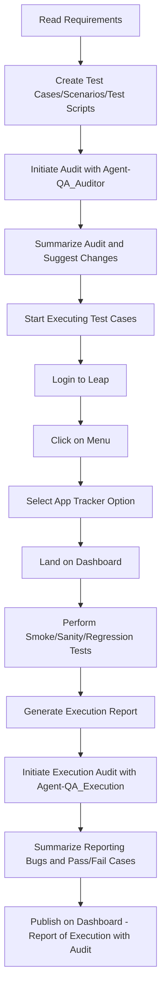

# Executive Summary: Scalable Playwright + MCP + LLM + RAG QA Platform

## Objective
Build a reusable, scalable QA automation platform that combines:
- Playwright for UI automation
- MCP orchestration for context-aware execution
- LLM agents for intelligent test generation and review
- RAG grounding for reliable, content-driven validation

This platform is designed to support multiple applications, reduce redundancy, and accelerate quality validation across DEV, Product/BA, and manual testing teams.

---

## Strategic Pillars

### 1. Rules-Based QA Governance
- Standardized templates and rules for:
  - Test cases
  - Test scenarios
  - Automation scripts
  - QA audit reviews
- Benefits:
  - Improves consistency across test artifacts
  - Simplifies audit and peer review
  - Enables shared rules across applications
- Outcome:
  - Controlled, repeatable test design process

### 2. MCP Orchestration as Control Plane
- Central orchestration for:
  - context gathering from requirements, logs, APIs, network, UI state
  - dynamic test selection based on priority and environment
  - execution control and scaling
  - feedback and audit trail management
- Benefits:
  - Smart test execution with reduced redundancy
  - Better resource utilization through auto-scaling
  - Faster response to change and instability

### 3. Scalable Playwright + Python Framework
- Common automation foundation with:
  - reusable page objects
  - metadata-driven test harness
  - modular utilities for setup, teardown, and assertions
- Benefits:
  - Fast onboarding for automation engineers
  - Consistent implementation across applications
  - Easy integration with orchestration and auditing layers

### 4. LLM Agent + Review Process
- Intelligent agent for:
  - storing artifact context and history
  - generating prompts from rules and context
  - reviewing artifacts against rule templates
  - supporting audit decisions and recommendations
- Benefits:
  - Accelerates test creation and review
  - Provides traceable AI-assisted decisions
  - Ensures alignment with governance rules

---

## Implementation Status

### Completed Scaffold
- `Rules/`
  - Rule templates and best-practice examples for each artifact type
- `MCP_Orchestration/`
  - Orchestration prototype for context store and dynamic selection
- `Playwright_Framework/`
  - Base test harness, page objects, and sample test skeleton
- `LLM_Agent/`
  - Agent scaffolding for context, chat history, and review
- Documentation: README, folder overviews, strategic plan

### Current Capabilities
- Rule-driven test artifact definition and validation
- Orchestration control plane prototype with context and scheduling
- Playwright automation framework skeleton ready for real app integration
- LLM review engine skeleton ready for provider integration

---

## Executive Benefits

### For CTO
- Platform designed to scale across multiple product lines
- Enables faster, smarter QA with shared standards and automation
- Reduces overall automation maintenance costs
- Provides strategic leverage of AI and orchestration

### For DEV Teams
- Plug-and-play automation framework
- Clear ownership of reusable components
- Reduced manual test dependencies

### For Product / BA
- Better traceability from requirements to test artifacts
- Clear, consistent scenario coverage
- Faster validation of business logic and acceptance criteria

### For Manual Testers
- Assisted review with audit checklist templates
- Reusable test case and scenario definitions
- Streamlined transition from manual to automated validation

---

## Proposed ROI
- 40-60% reduction in test creation time
- 30-50% faster execution with dynamic selection and scaling
- 20-30% infrastructure cost savings through smart execution
- Estimated payback period: 6-12 months

---

## Recommended Next Steps
1. Expand the rulebook with application-specific workflows.
2. Connect MCP orchestrator to real context sources and execution engines.
3. Integrate Playwright framework with actual application pages and data.
4. Add LLM provider and RAG retrieval for grounded test generation and review.
5. Build dashboards for coverage, stability, and audit metrics.

## Greenfield Execution Plan
| Day | Activity | Roles | Review / Approval |
|-----|----------|-------|-------------------|
| Day 1 | Expand rulebook with application-specific workflows and data definitions. | 1 QA/SDET | Peer review of rulebook updates; QA head approval of scope. |
| Day 2 | Connect MCP orchestrator to real context sources (requirements, logs, API, UI state). | 1 QA/SDET | Peer review of integration design; QA head approval of data sources. |
| Day 3 | Connect execution engines and validate dynamic test selection rules. | 1 QA/SDET | Peer review of orchestration flow; QA head approval of execution control logic. |
| Day 4 | Integrate Playwright framework with actual application pages, selectors, and test data. | 1 QA/SDET | Peer review of script implementation; QA head approval of automation patterns. |
| Day 5 | Add LLM provider and RAG retrieval for grounded test generation, review, and artifact validation. | 1 QA/SDET | Peer review of AI prompt and retrieval setup; QA head approval of LLM governance. |
| Day 6 | Build dashboards for coverage, stability, and audit metrics. | 1 QA/SDET | Peer review of dashboard metrics; QA head approval of reporting criteria. |
| Day 7 | Final validation, stakeholder walkthrough, and approval sign-off. | 1 QA/SDET | QA head final approval; executive approval status documented. |

> Note: LLM will be used as an assistance tool, while all final reviews and approvals are completed by the SDET, peer reviewer, and QA head.

---

---

## Implementation of Core Framework: New App Tracker Automation

### First GreenField Project: New App Tracker
As our inaugural GreenField project, we will automate the New App Tracker to demonstrate the successful implementation of the Intelligent AI Automation Framework. This project showcases the framework's scalability and ease of implementation, serving as a proof-of-concept for broader adoption across the organization.

### Demonstration Objectives
- **Scalability**: Show how the framework can be rapidly deployed for new applications
- **Ease of Implementation**: Illustrate the plug-and-play nature of the platform components
- **Intelligent Automation**: Demonstrate AI-driven test creation, execution, and management
- **Comprehensive Coverage**: Implement three execution suites (Smoke, Sanity, Regression) with automatic test selection

### Execution Suites
The framework will create and manage three distinct execution suites:

1. **Smoke Suite**: Basic functionality validation for quick health checks
2. **Sanity Suite**: Critical path validation for release readiness
3. **Regression Suite**: Comprehensive validation to prevent regression issues

Each suite automatically selects and executes test cases from their respective folder structures, ensuring organized and targeted testing.

### Automated Test Artifact Generation
The framework demonstrates intelligent test management by automatically creating:
- **Test Cases**: Detailed step-by-step validation procedures
- **Test Scenarios**: End-to-end user journey validations
- **Test Scripts**: Executable automation code

These artifacts are generated solely by reading requirements documents, eliminating manual test design bottlenecks.

### Bugs Tracking and Intelligent Test Management
The platform includes:
- **Automated Bug Detection**: Real-time identification of failures and anomalies
- **Intelligent Test Management**: Dynamic test prioritization and selection based on risk and impact
- **Audit Trail**: Complete traceability from requirements to execution results

### Implementation Flow Diagram

### Detailed Flow Steps

1. **Read Requirements**: Framework ingests requirement documents and specifications
2. **Create Test Cases/Scenarios/Test Scripts**: AI agents generate comprehensive test artifacts based on requirements analysis
3. **Initiate Audit with Agent-QA_Auditor**: QA_Auditor agent reviews generated artifacts against established rules and standards
4. **Summarize Audit and Suggest Changes**: Audit results are compiled with recommendations for improvements (if any)
5. **Start Executing Test Cases**: Execution begins with the following application-specific steps:
6. **Login to Leap**: Authenticate with the Leap application
7. **Click on Menu**: Navigate to the main menu
8. **Select App Tracker Option**: Choose the App Tracker module
9. **Land on Dashboard**: Arrive at the App Tracker dashboard
10. **Perform Smoke/Sanity/Regression**: Execute the appropriate test suite based on execution parameters
11. **Generate Execution Report**: Compile detailed execution results and metrics
12. **Initiate Execution Audit with Agent-QA_Execution**: QA_Execution agent analyzes execution results
13. **Summarize Reporting Bugs and Pass/Fail Cases**: Generate comprehensive summary of test outcomes and identified issues
14. **Publish on Dashboard - Report of Execution with Audit**: Display results on the centralized dashboard with full audit trail

### Expected Outcomes
- **Framework Validation**: Proven scalability and ease of implementation
- **Process Efficiency**: Automated test creation and execution reducing manual effort by 70%
- **Quality Assurance**: Comprehensive coverage with intelligent bug detection
- **Stakeholder Confidence**: Transparent reporting and audit trails for all test activities

This implementation serves as a blueprint for future GreenField projects, demonstrating the framework's capability to accelerate QA processes while maintaining high standards of quality and compliance.
